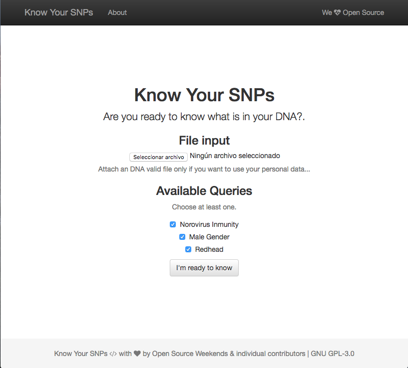
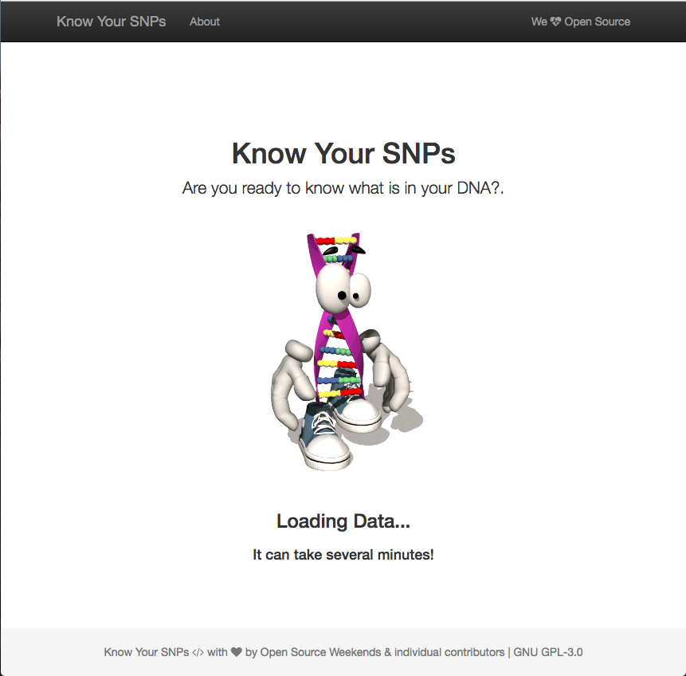

# know-your-SNPs
DNA Project....

### WorkingFlow

- **Welcome**

You can upload your DNA in txt format if your have it ( [supported vendors](http://genomejs.readme.io/docs/supported-vendors) ) or just use the demo data storaged in the server.

You need to choose at least one query.


- **Waiting for Results**


Note: It can take several minutes to parse data from txt to json and manage the internal queries.

- **Results**


You can see the results.


### Install & Setup

Install Node.js and NPM First.

```bash
npm install && node server
```
